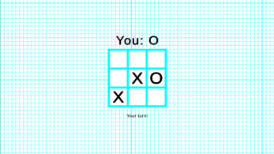

# Tic Tac Toe Multiplayer
Jogo Tic Tac Toe Multiplayer desenvolvido na plataforma Unity utilizando C# e JavaScript. Esse jogo pode ser jogado em navegadores incluindo mobile.

Além desse repositório o projeto conta com outro que possui o código que é executado no servidor, você pode acessar e saber mais sobre ele neste link:
[Tic Tac Toe Multiplayer Server](https://github.com/Alex5ander/tic-tac-toe-multiplayer-server)



## Para executar esse projeto você precisa ter instalado em seu computador a Unity 2023.1.19f1 e seguir os seguites passos

### Clone este repositório

```
git clone https://github.com/Alex5ander/tic-tac-toe-multiplayer.git
```

### Após clonado basta abrir o projeto na plataforma Unity

### Mas caso queira apenas jogar ele basta clicar em jogar abaixo.

[Jogar](https://alex5ander.itch.io/tic-tac-toe-multiplayer)